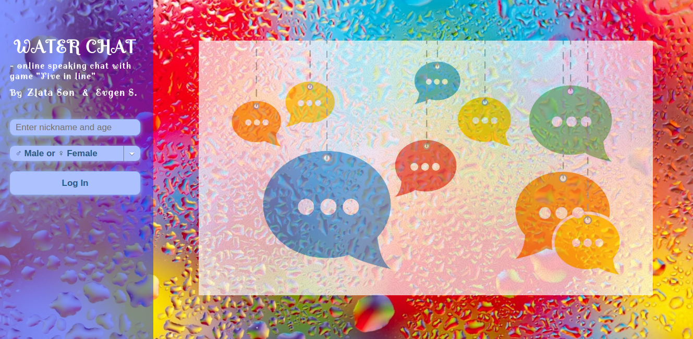
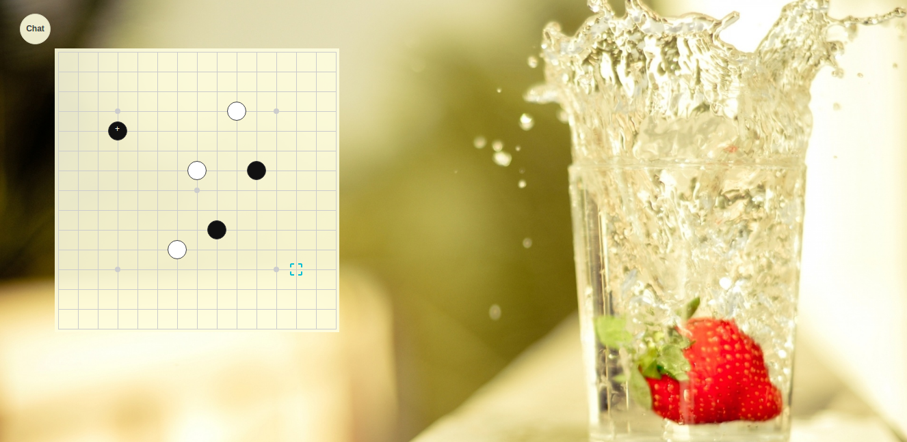
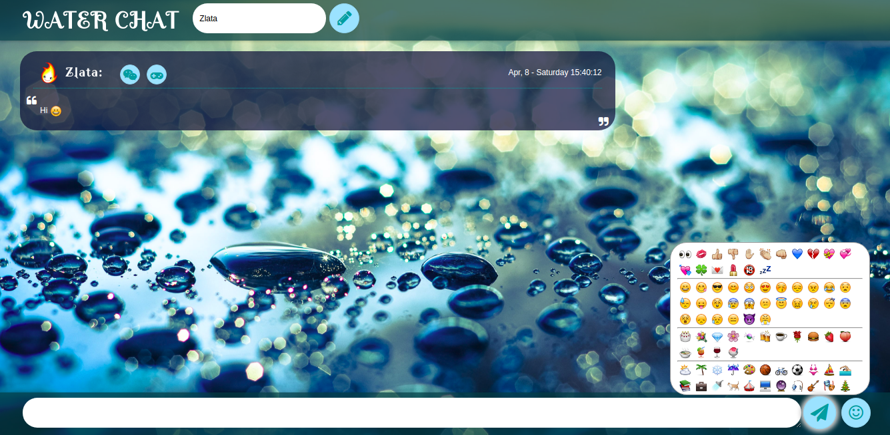

# GraduationProject
Graduation project for GeekHub - WATER CHAT (online speaking chat with game "Five in line" by Zlata Son & Evgen S.)

Part 1 (Zlata Son): Chat on sockets - specs

       Chat (client and server) should be deployed on
       heroku: https://dashboard.heroku.com/
       When you firstly log in - application asks you your nickname.
       There are should be an ability to change nickname.
       On the screen there should be a chat. Everyone can type anything there -
       and this should live reloaded for everyone else (time, nickname, message).
       This is public chat.
       Private chats: you can click on every name of person in the chat and this
       will open little separate chat (like in facebook) for both users.
       Private chats should send messages in 2 directions.
       Private chats can be closed by one user. Recommendations: http://socket.io/

Part 2 (Evgen): Five-in-line on React - specs

       Реализуйте на языке React JS игру «крестики-нолики пять-в-ряд» на поле NxN
       (N должно настраиваться в пользовательском интерфейсе).

       При реализации допускается использование сторонних библиотек.
       Обязательно укажите явно, какие готовые компоненты были использованы,
       их названия, лицензии и официальные сайты. Не допускается использование
       «конструкторов игр» — логика самой игры должна быть написана самим соискателем,
       на JavaScript.

       Реализация должна покрывать весь игровой процесс, «как у взрослых» — стартовый экран,
       экран завершения игры, возможность начать новую игру, прервать текущую и т.п.

       Плюсами будут:

       отсутствие перезагрузки страницы при действиях пользователя,
       использование canvas,
       кросс-браузерная совместимость с изящной деградацией фич (явно укажите,
       какие браузеры поддерживаются в какой мере),
       наличие звуковых эффектов и музыки (возьмите любые из доступных бесплатно),
       сохранение состояния игры при обновлении страницы без участия сервера,
       реализация игры против искусственного интеллекта.

       Приложение нужно залить на https://dashboard.heroku.com/

